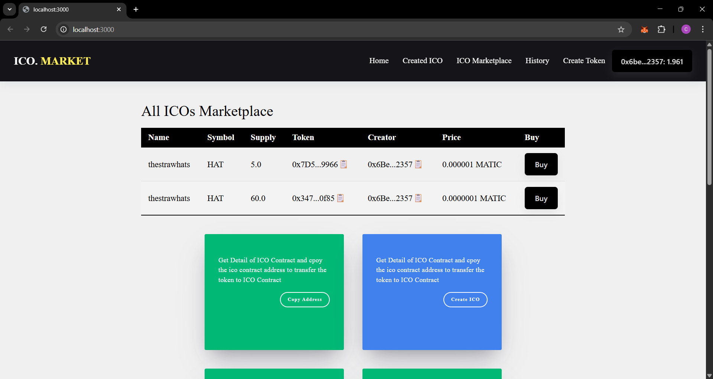
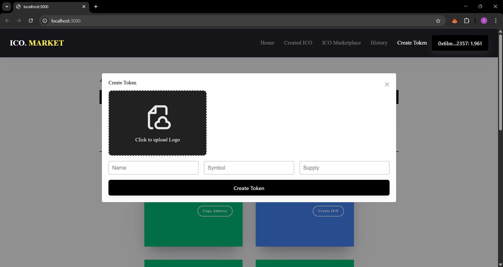
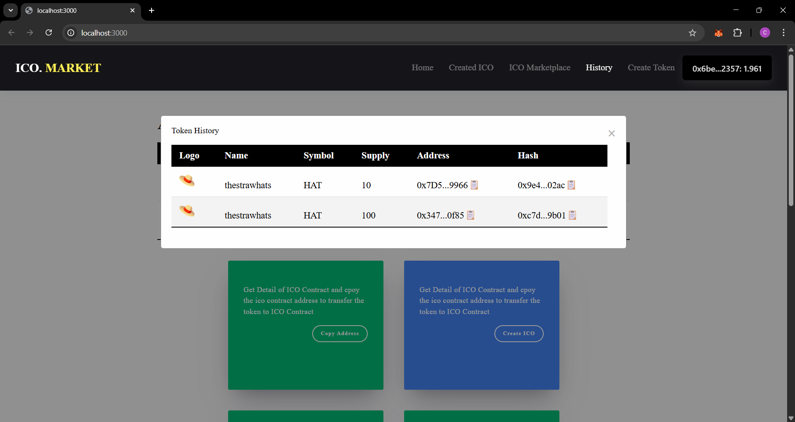
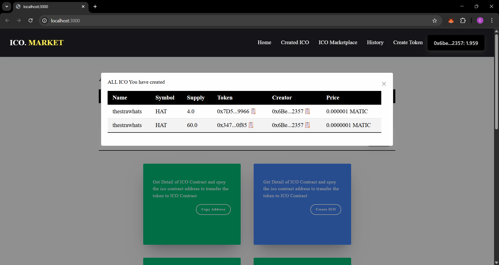
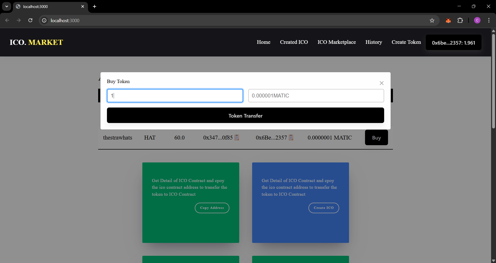
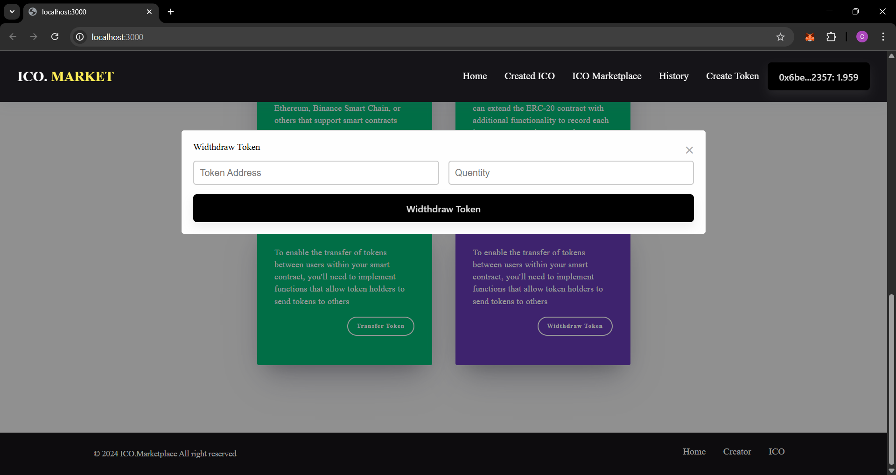

---

# 🪙 Crypto ICO Marketplace

## 📘 Buy, Create, and Manage ICOs & Tokens

A decentralized marketplace built with **Next.js** and **Ethers.js** that lets users create ERC‑20 tokens, launch ICO (pre‑sale) campaigns, buy tokens, and manage token flows (transfer / withdraw / history). The UI integrates wallet connection via **Web3Modal** and supports uploading token logos via **Pinata**.

---

## 👨‍💻 Project By: [@your-github-username]

## 🚀 About

This repository is a full‑stack frontend for a crypto ICO marketplace. It ships a polished React/Next.js UI and Solidity contracts (simple ERC‑20 + PreSale contract) so you can prototype token launches and a marketplace for pre‑sales. The project demonstrates token creation, token sale lifecycle, token purchases, and basic token management utilities.

---

## ✨ Features

* 🔧 **Create ERC‑20 Tokens** (token generator UI)
* 💸 **Create ICO / Pre‑Sale Campaigns** with configurable token price & supply
* 🛒 **Marketplace** to browse active ICOs and buy tokens
* 🔁 **Token Transfer** and **Withdraw** flows for token owners
* 🧾 **Token Purchase History** saved to local storage
* 🖼️ **Upload Token Logo** via Pinata IPFS integration
* 🔐 **Wallet Connect** using Web3Modal + Ethers.js
* 📸 **Screenshots** included in `public/Screenshots` for quick preview

---

## 🛠️ Technologies Used

**Frontend**

* Next.js (13)
* React 18
* Ethers.js & Web3Modal (wallet integration)
* Tailwind / CSS for styling

**Smart Contracts**

* Solidity (ERC‑20 token, PreSale contract)

**Other**

* Pinata (IPFS file uploads for logos)

---

## 📁 Project Structure (important files)

* `pages/` — Next.js pages (main app entry is `pages/index.js`)
* `Components/` — React components (CreateToken, CreateICO, BuyToken, Marketplace, TokenHistory, TokenTransfer, etc.)
* `Context/` — App context and blockchain helper functions (`index.js`, `constants.js`)
* `contracts/` — Solidity contracts (`ERC20.sol`, `PreSale.sol`)
* `public/Screenshots/` — UI screenshots
* `styles/globals.css` — Global styles
* `package.json` — Node scripts & dependencies

---

## ⚙️ Environment Variables

Create a `.env.local` file in the project root with the following values (replace placeholders):

```bash
NEXT_PUBLIC_PINATA_AIP_KEY=your_pinata_api_key
NEXT_PUBLIC_PINATA_SECRECT_KEY=your_pinata_secret_key
NEXT_PUBLIC_ICO_MARKETPLACE_ADDRESS=deployed_ico_marketplace_contract_address
```

> Note: The UI expects the ICO marketplace contract address when interacting with deployed contracts. If you don't have a deployed marketplace contract, you can deploy `PreSale.sol` / your marketplace contract using Remix or Hardhat and set the address here.

---

## 💻 Local Setup & Run (Frontend)

1. Install Node.js (v16+ recommended)
2. Install dependencies

```bash
cd Crypto_ICO_Marketplace-master
npm install
```

3. Start development server

```bash
npm run dev
# open http://localhost:3000
```

4. Build for production

```bash
npm run build
npm run start
```

---

## 🔧 Deploying Smart Contracts (quick guide)

This repo includes simple Solidity contracts under `contracts/`. No hardhat/truffle config is included, so you can deploy with one of these options:

 **Remix**

   * Open `contracts/PreSale.sol` and `contracts/ERC20.sol` in Remix.
   * Compile with the Solidity compiler version `^0.8.0`.
   * Deploy to your chosen network (e.g. Mumbai / Polygon testnet) using MetaMask.
   * Copy the deployed contract address and set `NEXT_PUBLIC_ICO_MARKETPLACE_ADDRESS`.


---

## 📝 Notes & Known Issues

* The `contracts/` directory contains sample contracts but may have small typos (this repo is intended as a prototype). Example issues to check before deployment:

  * Verify import paths for OpenZeppelin (should be `@openzeppelin/contracts/...`).
  * Double‑check ERC20 constructor and token minting logic.
* There are no automated tests included — consider adding Hardhat tests before using on mainnet.
* The app stores token purchase history in `localStorage` — this is for demo purposes only.

---

## 🖼️ Screenshots

Screenshots are available in `public/Screenshots`:


*  ICO Marketplace

  
  
*  Create Token

  
  
*  Create ICO

  
  
*  Token History

  
  
*  User Created_ICO

  
  
*  Token Transfer

  
  
*  Buy Token

  
  
*  Widthdraw Token

  
  
---

## 🤝 Contributing

If you'd like to improve this project:

1. Fork the repo
2. Create a feature branch
3. Submit a pull request with a clear description of your changes

Ideas
* Improve contract security and validations
* Persist history on‑chain or using a backend

---

## 📜 License

This project does not include an explicit license file. Add a LICENSE (e.g. MIT) if you plan to open source it publicly.

---

## 🙋‍♂️ Need Help?

If you'd like, I can:

* Generate a polished `README.md` file in the repo (I can add it to the workspace),
* Fix common Solidity issues and prepare the repo for deployment.

---
